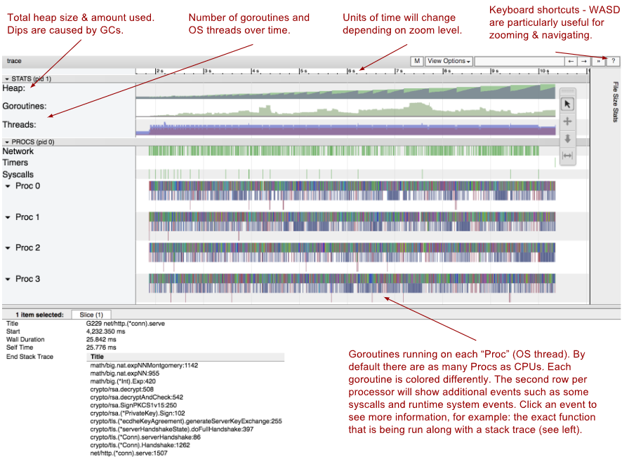
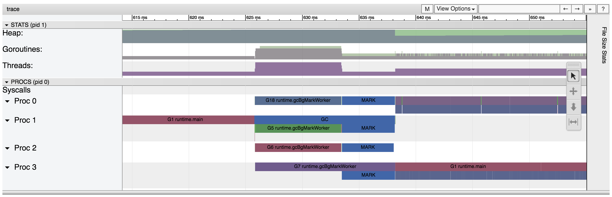
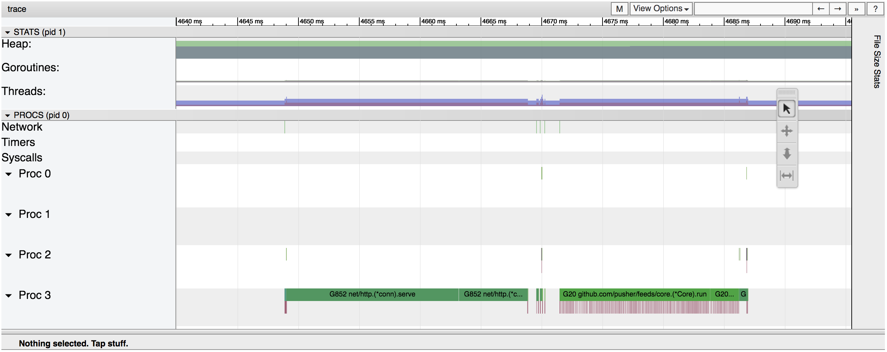
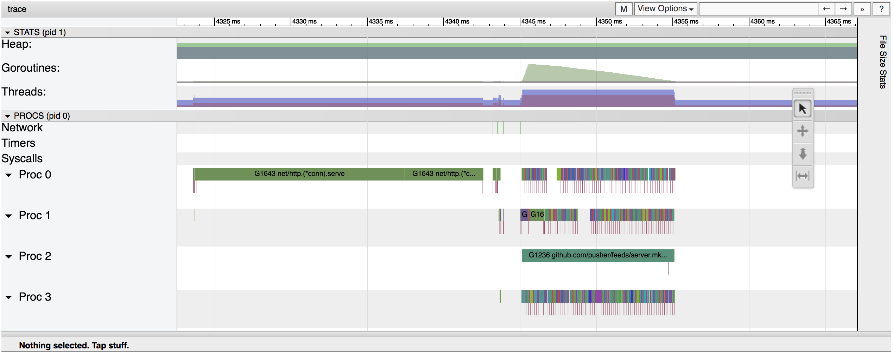

# Тестовый проект для трейсинга
По материалам: https://kovardin.ru/articles/go/go-tool-trace/
Оригинал: https://docs.google.com/document/d/1FP5apqzBgr7ahCCgFO-yoVhk4YZrNIDNf9RybngBc14/edit?pli=1&tab=t.0#heading=h.ayzntospglb3

На всякий случай pprof: https://go.dev/blog/pprof

Запустить (после формирования ```trace.out```):
```bash
go tool trace trace.out
```

Эта команда распарсит файл ```trace.out``` и откроет браузер с визуалайзером. 
По сути, программа запускает встроенный веб-сервер, который отображает данные в красивом виде. 
Как только стартовая страница загрузится, кликните на “View trace”. 



# Диагностика проблем с производительностью
Проблемы производительности могут возникать, когда важная go-рутина блокируется до завершения операции. 
Это может произойти по целому ряду причин: 
- блокировка на системном вызове; 
- блокировка при работе с общей памятью (каналы, мютексы и т.д.); 
- блокировка из-за различных событий рантайма(например, сборка мусора);
- планировщик не переключает критически важные рутины с необходимой частотой;
- и так далее.

Все перечисленные выше проблемы могут быть обнаружены с при использовании go tool trace. 
Вы можете найти признаки таких проблем на тамлайне “PROCS”, достаточно проверить периоды времени, когда критическая go-рутина необоснованно долго. 
Как только вы найдете такой период, просто посмотрите что было запущено в этот момент времени. Это, как минимум, подскажет вам в какую сторону копать.

Обратите внимание на долгие GC паузы:


Красным цветом показан период, когда была запущена только одна go-рутина. 
При сборке мусора на всех четырех тредах go-рутины запускаются в параллель. 
Во время фазы сборки мусора “MARK блокируется главная go-рутина. 
Можете сказать как долго была заблокирована go-рутина runtime.main? На 12 миллисекунд с 626 миллисекунды до 638 миллисекунды.

# Диагностирование проблем с параллелизмом
Предположим, что вы пишите программу, которая должна максимально утилизировать все CPUs, но она оказывается медленней, чем вы ожидали. 
Это вполне реально, если ваша программа распараллеливается не так как вы ожидали. 
Например, слишком много критических секций выполняется последовательно, хотя могли бы выполняться асинхронно (и параллельно).

Давайте посмотрим на примере. 
Скажем, у нас есть шина для pub/sub сообщений, которую мы хотим запустить в одной go-рутине, что позволит безопасно модифицировать мап подписчиков без использования мютексов. 
Обработчики запроса пишут входящие сообщения в очередь этой шины. 
Шина читает сообщения из очереди, проходит по мапе с подписчиками, определяет какому подписчику нужно отправить это сообщение, и пишет сообщение в его сокет. 
Давайте воспользуемся go tool trace чтобы посмотреть, как все выглядит внутри:



Первая зеленая секция показывает где http хендлер читает сообщения из запроса и пишет их в очередь нашей шины. 
После этого логика обработки сообщений запускается в одном потоке (вторая зеленая секция) и отправляет сообщения подписчикам.

Красные линии отмечают моменты времени, когда сообщения отправляются подписчикам. 
За какое время буду отправлены все сообщения? Ответ 16 миллисекунд, с 4671 миллисекунды до 4687 миллисекунды.

Проблема в том, что три из четырех тредов простаивают пока выполняется вся логика. 
Есть ли возможность оптимально их утилизировать? Конечно. 
Нет необходимости синхронно отправлять сообщения подписчикам. 
Это можно сделать конкурентно, в разных go-рутинах. 
Давайте посмотрим как это будет выглядеть:



Как вы можете видеть, теперь логика отправки сообщений работает на всех тредах, в разных go-рутинах.

Но действительно ли это быстрее? Ответ: отправка сообщений в примере выше занимает 16 миллисекунд. 
А теперь это 10 миллисекунд. Так что, да, это действительно быстрее.

Довольно интересно, что ускорение довольно скромное, несмотря на то что мы использовали в 4 раза больше процессов. 
Все дело в том, что при параллельной работе приходится мириться с большим оверхедом, связанным с запуском и остановкой go-рутин, работе с общей памятью, разделении кеша. 
Существует некоторый теоретический предел ускорения, который не позволит нам получить 4х кратное ускорение производительности: Amdahl’s Law.

На самом деле, бывает много ситуаций когда запускать код параллельно менее эффективно. 
Особенно, если go-рутины работают не долго или очень много общаются друг с другом. 
Это еще одна причина использования go tool trace, можно попробовать оба варианта и посмотреть что работает лучше.

# Когда go tool trace не может помочь?
Конечно, go tool trace не может решить все проблемы. 
Это не самый лучший помощник, если вы хотите найти самые медленно работающие функции или место, где программа использует больше всего CPU. 
Для этого вы можете использовать [go tool pprof](https://blog.golang.org/profiling-go-programs), который покажет вам процент использование CPU в различных функциях вашей программы. 
go tool trace лучше всего использовать, когда вам нужно понять что именно делает программа, но не для агрегации. 
Кроме того, есть и другие визуализации на основе go tool trace, наряду с “View Trace”, и они могут быть более удобными для диагностирования блокировок. 
И, конечно, этот инструмент не заменит теоретические расчеты производительности вашей программы (старое доброе большое 0).